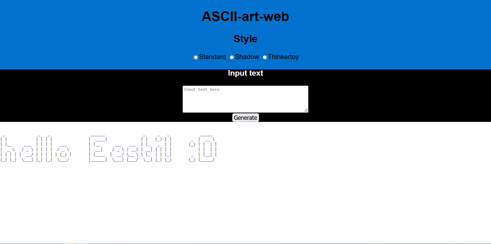

# Ascii Art

Here is an example of the website style:


Live version: 
https://ascii-art-kuv0.onrender.com/

## Usage
Hello! Please use WSL for this program.
This is a program which takes text and transforms it into ascii

Authors: aburnaz & mtalli & spitko

Usage: You first need to install [Docker](https://docs.docker.com/get-docker/)
Afterwards you have to run this command in your vscode terminal: 
```bash
bash run.sh
```
and open 
```bash
http://localhost:8080/
```
 in your browser.

